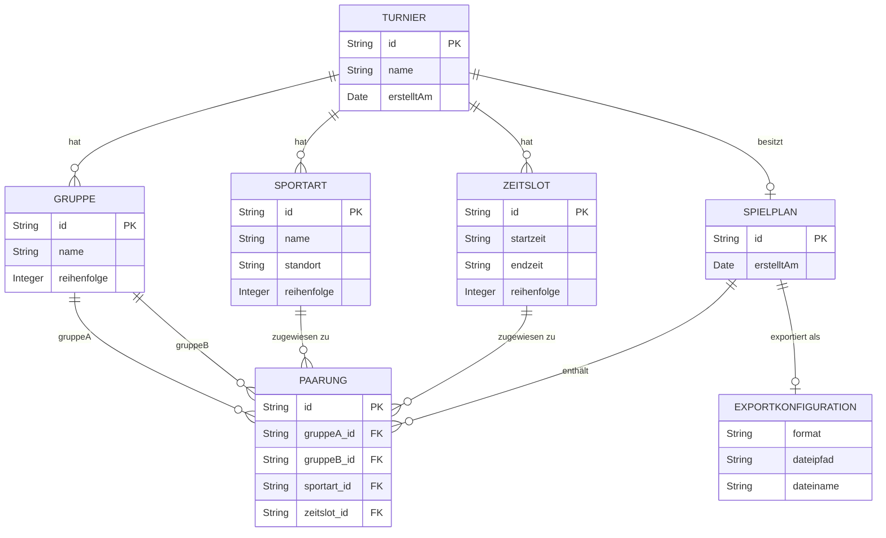

# Datenmodell – TournamentPlanner

## Entity-Relationship-Diagramm



## Swift-Datenmodell (Codierbare Structs)

```swift
import Foundation

// MARK: - Root

struct Turnier: Codable, Identifiable {
    let id: UUID
    var name: String
    let erstelltAm: Date
    var gruppen: [Gruppe]
    var sportarten: [Sportart]
    var zeitslots: [Zeitslot]
    var spielplan: Spielplan?
}

// MARK: - Konfigurationsobjekte

struct Gruppe: Codable, Identifiable {
    let id: UUID
    var name: String
    var reihenfolge: Int
}

struct Sportart: Codable, Identifiable {
    let id: UUID
    var name: String
    var standort: String?   // optional, z. B. "Halle 1"
    var reihenfolge: Int
}

struct Zeitslot: Codable, Identifiable {
    let id: UUID
    var startzeit: String   // HH:mm, Pflicht
    var endzeit: String     // HH:mm, optional leer
    var reihenfolge: Int
}

// MARK: - Spielplan

struct Spielplan: Codable, Identifiable {
    let id: UUID
    let erstelltAm: Date
    var paarungen: [Paarung]          // platzierte Paarungen
    var nichtPlatziert: [Paarung]     // aktuell nur für manuelle Alt-/Importfälle; Generator lässt bei Prioritätskonflikten Zellen leer
}

struct Paarung: Codable, Identifiable {
    let id: UUID
    let gruppeAId: UUID
    let gruppeBId: UUID
    var sportartId: UUID?   // nil = nicht platziert
    var zeitslotId: UUID?   // nil = nicht platziert
}

// MARK: - Export

enum ExportFormat: String, Codable, CaseIterable {
    case xlsx = "XLSX"
    case pdf  = "PDF"
}

struct ExportKonfiguration: Codable {
    let format: ExportFormat
    let dateipfad: String
    let dateiname: String
}
```

## Constraints-Übersicht

| Constraint | Beschreibung | Business Rule |
|---|---|---|
| Gruppe.name UNIQUE per Turnier | Keine zwei Gruppen dürfen denselben Namen haben (case-insensitive) | BR-001 |
| Turnier.gruppen.count ≥ 2 | Mindestens 2 Gruppen für einen sinnvollen Spielplan | BR-002 |
| Turnier.sportarten.count ≥ 1 | Mindestens eine Sportart erforderlich | BR-002 |
| Turnier.zeitslots.count ≥ 1 | Mindestens ein Zeitslot erforderlich | BR-002 |
| (Gruppe, Sportart) Mindestabdeckung | Jede Gruppe soll jede Sportart mindestens einmal spielen; Wiederholungen sind erlaubt | BR-003 |
| (Gruppe, Zeitslot) UNIQUE per Spielplan | Keine Gruppe zweimal im gleichen Zeitslot | BR-004 |
| (Sportart, Zeitslot) UNIQUE per Spielplan | Jede Zelle maximal eine Paarung | strukturell |
| gruppeAId ≠ gruppeBId | Eine Gruppe kann nicht gegen sich selbst spielen | strukturell |
| Paarung (A,B) Wiederholungen minimieren | Gegnerwiederholungen sind erlaubt, werden aber zuletzt minimiert | Optimierungspriorität |
