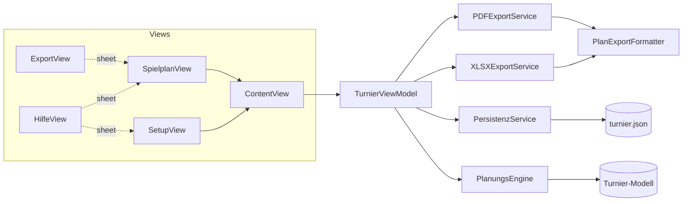
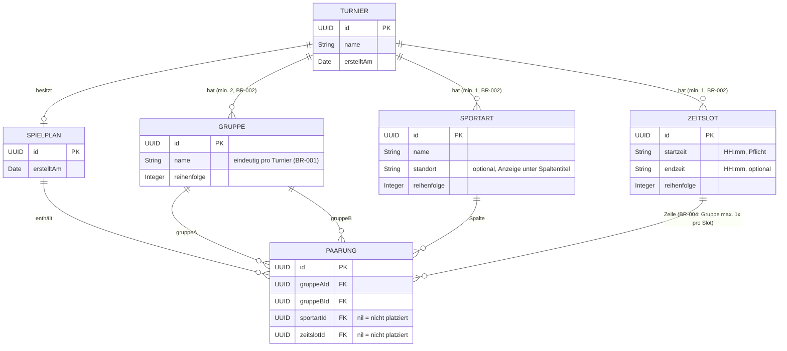

# ARCH-001 – Architektur TournamentPlanner

Stand: 2026-06-11

---

## 1. Überblick

TournamentPlanner ist eine native macOS-App (SwiftUI, macOS 14+) nach dem **MVVM-Muster** ohne externe Abhängigkeiten. Die App arbeitet vollständig offline; persistiert wird ein einziges JSON-Dokument im Application-Support-Verzeichnis.

| Schicht | Komponenten | Verantwortung |
|---|---|---|
| **Model** | `Turnier`, `Gruppe`, `Sportart`, `Zeitslot`, `Spielplan`, `Paarung`, `PlanungsEngine` | Datenstrukturen (Codable) und Planungs-Algorithmus (BR-003/004/005) |
| **ViewModel** | `TurnierViewModel` | Zustand, Validierung (BR-001/002), Orchestrierung von Engine, Persistenz und Export |
| **Services** | `PersistenzService`, `PlanExportFormatter`, `XLSXExportService`, `PDFExportService` | JSON-Speicherung, Export-Formatierung, Dateierzeugung |
| **Views** | `ContentView`, `SetupView`, `SpielplanView`, `ExportView`, `HilfeView` + Komponenten | SwiftUI-Darstellung, Drag-and-drop, Hilfe |

## 2. Entity-Relationship-Diagramm

Detail-Spezifikationen: [DO-001 … DO-007](../data-objects/).

## 3. Planungs-Algorithmus (BR-005)

Mehrere randomisierte Läufe (Multi-Start); pro Lauf:

1. **Phase 1 – Abdeckung**: Fehlende (Gruppe, Sportart)-Kombinationen schliessen; Paarungen mit Synergie 2 (beide Gruppen profitieren) bevorzugt, Tie-Break auf Gegnerwiederholungen.
2. **Phase 2 – Füllung**: Zellen mit den wenigsten Kandidaten zuerst (most-constrained-first); Kandidaten nach wenigsten Wiederholungen, dann geringster Gesamtspielzahl.
3. **Verbesserungs-Pass**: Wiederholte Paarungen werden durch ungespielte ersetzt, sofern Abdeckung und Füllrate gleich bleiben.

Der beste Lauf gewinnt nach `PlanBewertung`, strikt lexikographisch: Abdeckung → Gegnerwiederholungen → Füllrate. BR-004 ist jederzeit harte Bedingung.

## 4. Persistenz

- Ablage: `~/Library/Application Support/TournamentPlanner/turnier.json` (atomar geschrieben, ISO-8601-Daten).
- **Migration**: `Zeitslot` dekodiert Altbestände mit `bezeichnung`-Feld und übernimmt diese als `startzeit`; `Sportart.standort` ist optional und abwärtskompatibel.

## 5. Testabdeckung

Erhoben am 2026-06-11 mit `xcodebuild test -enableCodeCoverage YES` / `xccov` (11 Tests, alle grün).

| Datei | Coverage | Bemerkung |
|---|---|---|
| **Gesamt (App-Target)** | **57.4 %** (1590/2769 Zeilen) | |
| PDFExportService | 98.1 % | Querformat- und Paginierungstests |
| XLSXExportService | 94.7 % | Struktur-, Standort- und XML-Escaping-Tests |
| SportartenListeView | 93.2 % | über View-Body-Auswertung |
| ContentView | 92.8 % | |
| ZeitslotListeView | 91.0 % | |
| GruppenListeView | 90.6 % | |
| TournamentPlannerApp | 87.5 % | |
| PlanungsEngine | 82.3 % | Kernlogik inkl. Verschiebe-Konflikte (BR-004) |
| Turnier (Modell) | 76.9 % | |
| PlanExportFormatter | 76.2 % | |
| SetupView | 75.2 % | |
| PersistenzService | 56.3 % | Fehlerpfade ungetestet |
| TurnierViewModel | 28.3 % | Export-/Drag-and-drop-Orchestrierung nur manuell getestet |
| SpielplanView / ExportView / PaarungsZelleView / HilfeView | 0 % | reine UI; nicht von Unit-Tests instanziert |

**Einordnung**: Die Geschäftslogik (Engine, Exporte, Modell) ist gut abgedeckt; die 0-%-Dateien sind SwiftUI-Views, deren Verhalten nur über UI-Tests messbar wäre. Grösstes sinnvolles Verbesserungspotenzial: `TurnierViewModel` (Validierungs- und Verschiebe-Pfade) und Fehlerpfade der Persistenz.

## 6. Security-Betrachtung

| Aspekt | Befund | Bewertung |
|---|---|---|
| Netzwerkzugriffe | Keine — App arbeitet vollständig offline | ✅ |
| Persistenz | Lokales JSON ohne sensible Daten, atomare Schreibvorgänge | ✅ |
| XLSX-Erzeugung | `Process` mit absolutem Pfad `/usr/bin/zip`, Argumente ohne Shell-Interpretation → keine Injection | ✅ |
| XML-Escaping | Benutzereingaben (`&`, `<`, `>`, `"`) werden escaped; per Test abgesichert | ✅ |
| Dateipfade | Zielpfade ausschliesslich über `NSSavePanel` (User-Intent) | ✅ |
| Drag-and-drop | Eingehende Daten werden strikt als UUID geparst, sonst verworfen | ✅ |
| Eingabe-Limits | Längen-Constraints aus DO-Specs (1–50 Zeichen) werden im UI nicht erzwungen | ⚠️ kosmetisch |
| App Sandbox / Hardened Runtime | Nicht aktiviert (Debug-Signierung "Sign to Run Locally") | ⚠️ für Distribution ausserhalb des eigenen Macs empfohlen |

## 7. Bekannte Grenzen

- Ein Turnier pro App-Instanz (Single-Document-Modell).
- Keine Undo-Funktion beim manuellen Verschieben.
- Die Planung ist heuristisch (Multi-Start-Greedy mit lokaler Verbesserung), nicht beweisbar optimal — für die Eingabegrössen der Praxis (≤ 12 Gruppen) liefert sie zuverlässig wiederholungsfreie Pläne, wo solche existieren.
